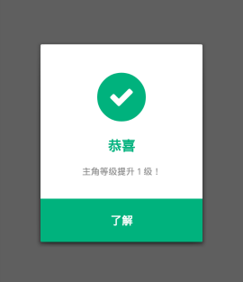
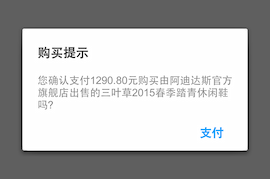
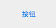
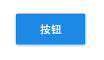
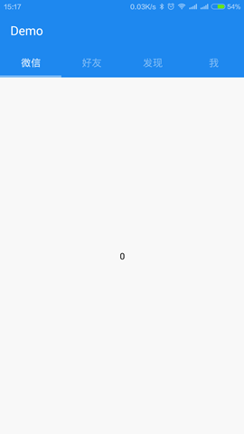

# Simi

* [快速开始](#快速开始)
* [API](#API)
    * [网络访问](#网络访问)
       * [异步请求 + v1.0.0](#异步请求)
    * [图片相关](#图片相关)
       * [基础转换 + v1.0.1](#基础转换)
       * [缓存下载 + v1.0.1](#缓存下载)
    * [管理工具](#管理工具)
       * [状态栏 + v1.0.3](#状态栏)
    * [常规工具](#常规工具)
       * [字符处理 + v1.0.1](#字符处理)
* [UI](#UI)
    * [对话框](#对话框)
       * [警告框 + v1.0.2](#警告框)
       * [简单对话框 + v1.0.4](#简单对话框)
    * [组件](#组件)
       * [平面按钮 + v1.0.5](#平面按钮)
       * [矩形按钮 + v1.0.5](#矩形按钮)
       * [图角视图 + v1.0.5](#图角视图)
    * [布局](#布局)
       * [视图控制器 + v1.0.5](#视图控制器)
       * [涟漪布局 + v1.0.3](#涟漪布局)

## 快速开始

###### Android Studio
在build.gradle中添加：
```xml
dependencies {
    compile 'io.simi:simi:1.2.0'
}
```
###### Eclipse
```xml
1. 下载simi-v1.2.0.jar拷贝到工程目录/libs下
2. 下载FontAwesome字体(http://fortawesome.github.io/Font-Awesome/assets/font-awesome-4.3.0.zip)
3. 工程目录/assets下新建目录/fonts并拷贝FontAwesome字体到fonts/下重命名为:fontawesome.ttf
```

##API

####网络访问

######异步请求
```xml
//创建异步网络访问参数实例
HttpParams params = new HttpParams();

//添加参数，支持基础类型与String、List等
params.put("name", "Selly");

//创建异步网络客户端实例
HttpClient client = new HttpClient();

//开启调试模式
client.setDebugMode(true);

//发起POST类型访问
client.newTask(HTTP.POST, "http://xxx.com/register", params, new OnHttpResponseListener() {
    @Override
    public void onSuccess(String response) {}

    @Override
    public void onFailure(Exception exception) {}

    @Override
    public void onStart() {}

    @Override
    public void onFinish() {}
});
```

####图片相关

######基础转换
```xml
//创建图片实例
Image image;
image = new Image(getResources(), R.drawable.xxx);
image = new Image(drawable);
image = new Image(bitmap);
image = new Image(byte[]);
image = new Image(fileName)；

//输出Bitmap
image.toBitmap();

//输出Drawable
image.toDrawable();

//输出Byte[]
image.toJPGByte();
image.toPNGByte();

//图片加圆角
image.transformRadius(4);

//图片裁剪圆形
image.transformRound();

//生成静态图片背景
Image.createDrawable(0xFFFFFFFF, 255, 4);
```

######缓存下载
```xml
//创建单一实例
ImageLoader mLoader = ImageLoader.getInstance(this);

//下载网络图片并缓存
mLoader.loadBitmapByHttp(view, url, new ImageLoader.OnImageLoadListener() {
   @Override
   public void onImageLoadCompleted(View view, Bitmap bitmap, String url) {
      //to do something...
      //for example:
      //    ImageView imageView = (ImageView)view;
      //    imageView.setImageBitmap(bitmap);
   }
});

//下载本地图片并缓存
mLoader.loadBitmapByFile(view, fileName, new ImageLoader.OnImageLoadListener() {
   @Override
   public void onImageLoadCompleted(View view, Bitmap bitmap, String fileName) {
      //to do something...
   }
});

//手动添加图片到缓存(同步)
//key可以任意不为空的字符串
//xxx支持类型有Drawable, Bitmap, byte[], Image
mLoader.putBitmap(key, xxx, true);

//手动添加图片到缓存(异步)
mLoader.putBitmap(key, xxx, false);

//取出手动添加到缓存的图片
mLoader.loadBitmap(key);
```

####管理工具

######状态栏


```xml
@Override
protected void onCreate(Bundle savedInstanceState) {
   super.onCreate(savedInstanceState);
   setContentView(R.layout.activity_main);
   //支持0xfffffff颜色与Drawable图片
   //颜色可以通过getResource().getColor(R.color.XXX)获得
   //图片可以通过getResource().getDrawable(R.drawable.xxx)获得
   new StatusBarManager(this).setColor(0xFF009EFC);
}
```


####常规工具

######字符处理
```xml
//字符串MD5加密
StringUtils.encryptMD5(string);

//字符串SHA256加密
StringUtils.encryptSHA256(string);

//检查字符串是否是银行卡号
StringUtils.isBankCardCode(string);

//检查字符串是否是出生日期
StringUtils.isDateOfBirth(string);

//检查字符串是否是电子邮箱
StringUtils.isEmail(string);

//检查字符串是否是纯数字
StringUtils.isNumber(string);
```

##UI

####对话框

######警告框


```xml
//LEVEL:VERBOSE, INFO, WARNING, ERROR, CUSTOMER
new WarningDialog(this, LEVEL.INFO, "恭喜", "主角等级提升１级！", "了解").show;

//如果想要监听Dismiss
new WarningDialog(this, LEVEL.INFO, "恭喜", "主角等级提升１级！", "了解", new OnDismissListener() {
   @Override
   public void onDismiss() {
      //to do something...
   }
}).show;

//当然也可以选择自定义
WarningDialog dialog = new WarningDialog(this, LEVEL.CUSTOMER, "恭喜", "主角等级提升１级！", "了解");
dialog.setCustomerType(FONT_AWESOME.FA_CHECK, 0xFF009EFC);
dialog.show();
```
######注：具体支持的图标请转到Font Awesome Icon(http://fortawesome.github.io/Font-Awesome/icons/#new)

######简单对话框


```xml
//快速使用
new SimpleDialog(this, "标题", "内容", "确认", new OnConfirmListener() {
     @Override
     public void onConfirm() {
        //to do something...
     }
}).show();

//具体使用
//添加取消字样
dialog.setCancelText("取消");

//监听Dismiss
dialog.setOnDismissListener(new OnDismissListener() {
    @Override
    public void onDismiss() {
        //to do something...
    }
});
```

####组件

######平面按钮


```xml
<io.simi.widget.FlatButton
    android:layout_width="wrap_content"
    android:layout_height="wrap_content"
    android:background="#1E88E5"
    android:text="按钮"
    android:textSize="16sp" />
```

######矩形按钮


```xml
<io.simi.widget.RectangleButton
    android:layout_width="wrap_content"
    android:layout_height="wrap_content"
    android:background="#1E88E5"
    android:text="按钮"
    android:textSize="16sp" />
```

######圆角视图


使用说明：
```xml
1. 该布局拥有自定义属性，使用时需要在XML的根布局下添加：xmlns:simi="http://schemas.android.com/simi"
2. 该布局支持的自定义属性如下：
    * simi:radius="12" （圆角大小）
    * simi:circleMode="true" （是否开启圆形模式，true开启后圆角属性无效）
```
XML布局使用示例
```xml
<io.simi.widget.ImageRoundView
    android:layout_width="96dp"
    android:layout_height="96dp"
    android:src="@drawable/img"
    simi:radius="12" />

<io.simi.widget.ImageRoundView
    android:layout_width="96dp"
    android:layout_height="96dp"
    android:src="@drawable/img"
    simi:circleMode="true" />
```
####布局

######视图控制器



使用说明：
```xml
1. 该布局继承于RelativeLayout，但不建议在布局内使用其他控件
2. 该布局拥有自定义属性，使用时需要在XML的根布局下添加：xmlns:simi="http://schemas.android.com/simi"
3. 该布局支持的自定义属性如下：
    * simi:type="top" （导航栏位置，top上方、top_float上方且浮空、bottom下方以及bottom_float下方且浮空）
    * simi:contentColor="#FFFFFF" （内容背景颜色）
    * simi:navigatorColor="#1E88EF" （导航栏背景颜色）
    * simi:textSize="16" （导航栏字号）
    * simi:textColor="#66FFFFFF" （导航栏字体颜色）
    * simi:indicatorColor="#66FFFFFF" （选中指示线颜色）
    * simi:textSelectColor="#CCFFFFFF" （导航栏选中字体颜色）
```
XML布局使用示例
```xml
<io.simi.widget.ViewController
    android:id="@+id/mViewController"
    android:layout_width="match_parent"
    android:layout_height="match_parent"
    simi:type="top"
    simi:contentColor="#FFFFFF"
    simi:navigatorColor="#1E88EF"
    simi:textSize="16"
    simi:textColor="#66FFFFFF"
    simi:indicatorColor="#66FFFFFF"
    simi:textSelectColor="#CCFFFFFF">
</io.simi.widget.ViewController>
```
Activity代码写法：
```xml
private ViewController mViewController;

@Override
protected void onCreate(Bundle savedInstanceState) {
    super.onCreate(savedInstanceState);
    setContentView(R.layout.activity_main);
    mViewController = (ViewController) findViewById(R.id.mViewController);
    mViewController.setAdapter(new PagerAdapter(getSupportFragmentManager()));
}

class PagerAdapter extends FragmentPagerAdapter {
    private final String[] titles = { "微信", "好友", "发现", "我"};
    public PagerAdapter(FragmentManager fm) {
        super(fm);
    }
    @Override
    public CharSequence getPageTitle(int index) {
        return titles[index];
    }
    @Override
    public int getCount() {
        return titles.length;
    }
    @Override
    public Fragment getItem(int index) {
        return new MyFragment(index);
    }
}
```

######涟漪布局

该布局继承于LinearLayout
```xml
<io.simi.widget.RippleLayout xmlns:android="http://schemas.android.com/apk/res/android"
    xmlns:tools="http://schemas.android.com/tools"
    android:layout_width="match_parent"
    android:layout_height="match_parent"
    android:orientation="vertical">
</io.simi.widget.RippleLayout>
```
